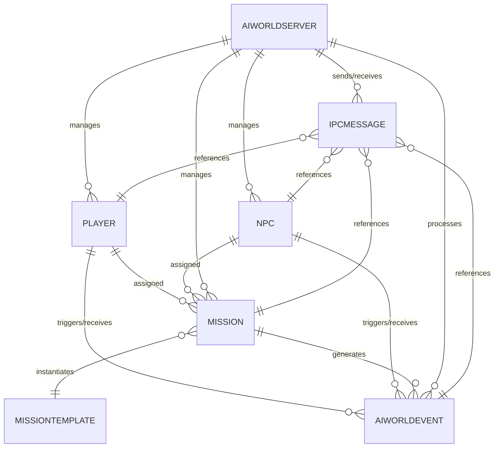

# Entity Relationship Diagram (ERD): AI-Autonomous-World rAthena Plugin

## Overview

This ERD describes the core entities, relationships, and data flows for the AI-Autonomous-World plugin/module and its integration with the rAthena ecosystem. The design supports robust, high-performance AI orchestration, mission/entity management, and real-time event handling.

---

## Key Entities

### 1. Player
- **Attributes:** player_id, name, account_id, current_map, position, state, active_missions, stats, inventory
- **Relationships:** 
  - Participates in Missions
  - Interacts with NPCs
  - Triggers Events

### 2. NPC
- **Attributes:** npc_id, name, type, current_map, position, state, ai_profile, assigned_missions
- **Relationships:** 
  - Assigned Missions
  - Interacts with Players
  - Triggers/Receives Events

### 3. Mission
- **Attributes:** mission_id, type, objectives, rewards, status, assigned_to (player_id/npc_id), progress, start_time, end_time
- **Relationships:** 
  - Assigned to Player or NPC
  - Linked to MissionTemplate
  - Generates Events

### 4. MissionTemplate
- **Attributes:** template_id, type, objectives, reward_schema, ai_parameters
- **Relationships:** 
  - Instantiates Missions

### 5. AIWorldEvent
- **Attributes:** event_id, type, source (player/npc/system), target, payload, timestamp, status
- **Relationships:** 
  - Linked to Player, NPC, or Mission
  - Consumed by AIWorld Server and rAthena

### 6. AIWorldServer
- **Attributes:** server_id, status, config, modules, logs
- **Relationships:** 
  - Manages Missions, Entities, and Events
  - Communicates with rAthena via IPC

### 7. IPCMessage
- **Attributes:** message_id, type, payload, sender, receiver, timestamp, status
- **Relationships:** 
  - Transports data between rAthena and AIWorldServer

---

## ERD Diagram

---

## Data Flow

1. **Mission Assignment:**  
   - Player/NPC requests a mission via script command.
   - rAthena plugin sends IPCMessage to AIWorldServer.
   - AIWorldServer creates Mission, links to Player/NPC, and responds with assignment.
   - Mission progress and events are tracked and updated in real time.

2. **Event Handling:**  
   - Player/NPC actions trigger AIWorldEvents.
   - Events are sent to AIWorldServer for processing (e.g., AI decision, mission update).
   - AIWorldServer may update entity state, assign new missions, or trigger world changes.

3. **Entity State Sync:**  
   - rAthena and AIWorldServer continuously sync Player, NPC, and Mission state via IPCMessages.
   - Ensures consistency and low-latency updates for all AI-driven features.

---

## Error Handling & Logging

- All entities and relationships are validated for consistency.
- Errors in mission assignment, event processing, or IPC are logged and surfaced to scripts.
- Audit trails are maintained for all mission and event changes.

---

## Extensibility

- New entity types (e.g., Faction, WorldZone) can be added as needed.
- AI modules can extend MissionTemplate, AIWorldEvent, and entity logic.
- IPC protocol is versioned for future expansion.
