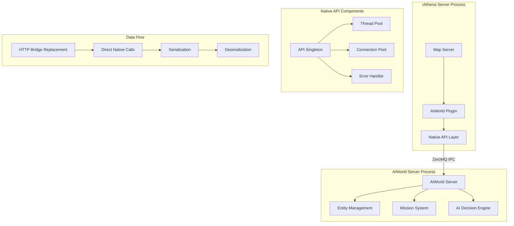

# Native C++ API Layer Design - HTTP Bridge Replacement

## Overview
This document outlines the production-ready native C++ API layer to replace the HTTP bridge functionality, providing direct integration with the existing ZeroMQ IPC framework.

## API Endpoint Mapping

### 1. NPC Registration
**HTTP:** `POST /ai/npc/register` → **Native:** `registerNPC()`

### 2. NPC Events  
**HTTP:** `POST /ai/npc/event` → **Native:** `processNPCEvent()`

### 3. NPC Interactions
**HTTP:** `POST /ai/npc/{id}/interact` → **Native:** `handleNPCInteraction()`

### 4. NPC State Queries
**HTTP:** `GET /ai/npc/{id}/state` → **Native:** `getNPCState()`

## API Specification

### Core API Header (`aiworld_native_api.hpp`)

```cpp
#pragma once
#include <string>
#include <nlohmann/json.hpp>
#include <memory>
#include "aiworld_messages.hpp"
#include "aiworld_types.hpp"

namespace aiworld {

class AIWorldNativeAPI {
public:
    // Singleton access
    static AIWorldNativeAPI& getInstance();
    
    // Initialization
    bool initialize(const std::string& zmq_endpoint = "tcp://127.0.0.1:5555");
    void shutdown();
    
    // --- Core API Functions ---
    
    /**
     * Register a new NPC with the AI system
     * @param npc_id Unique NPC identifier
     * @param npc_data NPC configuration and initial state
     * @param timeout_ms Operation timeout in milliseconds
     * @return APIResult containing success status and response data
     */
    APIResult registerNPC(const std::string& npc_id, 
                         const nlohmann::json& npc_data,
                         int timeout_ms = 3000);
    
    /**
     * Process NPC event notification
     * @param event_type Type of event (combat, social, economic, etc.)
     * @param event_data Event-specific data payload
     * @param source_id Entity that triggered the event
     * @param target_id Entity affected by the event
     * @param timeout_ms Operation timeout in milliseconds
     * @return APIResult containing success status and response data
     */
    APIResult processNPCEvent(const std::string& event_type,
                             const nlohmann::json& event_data,
                             const std::string& source_id = "",
                             const std::string& target_id = "",
                             int timeout_ms = 3000);
    
    /**
     * Handle NPC interaction (player-NPC or NPC-NPC)
     * @param npc_id Target NPC identifier
     * @param interaction_type Type of interaction (talk, trade, combat, etc.)
     * @param interaction_data Interaction-specific parameters
     * @param initiator_id Entity initiating the interaction
     * @param timeout_ms Operation timeout in milliseconds
     * @return APIResult containing success status and response data
     */
    APIResult handleNPCInteraction(const std::string& npc_id,
                                  const std::string& interaction_type,
                                  const nlohmann::json& interaction_data,
                                  const std::string& initiator_id = "",
                                  int timeout_ms = 3000);
    
    /**
     * Query comprehensive NPC state including world concept design fields
     * @param npc_id Target NPC identifier
     * @param fields Specific fields to retrieve (empty for all)
     * @param timeout_ms Operation timeout in milliseconds
     * @return APIResult containing success status and NPC state data
     */
    APIResult getNPCState(const std::string& npc_id,
                         const std::vector<std::string>& fields = {},
                         int timeout_ms = 3000);
    
    // --- Advanced World Concept Methods ---
    
    /**
     * Update NPC consciousness (personality, background, skills)
     * @param npc_id Target NPC identifier
     * @param consciousness_data Consciousness model data
     * @param timeout_ms Operation timeout in milliseconds
     * @return APIResult containing success status
     */
    APIResult updateNPCConsciousness(const std::string& npc_id,
                                    const nlohmann::json& consciousness_data,
                                    int timeout_ms = 3000);
    
    /**
     * Update NPC memory (episodic, semantic, procedural)
     * @param npc_id Target NPC identifier
     * @param memory_data Memory system data
     * @param timeout_ms Operation timeout in milliseconds
     * @return APIResult containing success status
     */
    APIResult updateNPCMemory(const std::string& npc_id,
                             const nlohmann::json& memory_data,
                             int timeout_ms = 3000);
    
    /**
     * Update NPC goals and motivations
     * @param npc_id Target NPC identifier
     * @param goals_data Goal hierarchy data
     * @param timeout_ms Operation timeout in milliseconds
     * @return APIResult containing success status
     */
    APIResult updateNPCGoals(const std::string& npc_id,
                            const nlohmann::json& goals_data,
                            int timeout_ms = 3000);
    
    /**
     * Update NPC emotional state
     * @param npc_id Target NPC identifier
     * @param emotion_data Emotional state data
     * @param timeout_ms Operation timeout in milliseconds
     * @return APIResult containing success status
     */
    APIResult updateNPCEmotion(const std::string& npc_id,
                              const nlohmann::json& emotion_data,
                              int timeout_ms = 3000);
    
    // --- Utility Methods ---
    bool isConnected() const;
    std::string getEndpoint() const;
    size_t getPendingRequests() const;
    
private:
    AIWorldNativeAPI();
    ~AIWorldNativeAPI();
    
    // Internal implementation
    class Impl;
    std::unique_ptr<Impl> pimpl;
};

// API Result Structure
struct APIResult {
    bool success;
    int error_code;
    std::string error_message;
    nlohmann::json data;
    // Optional: Original correlation ID for tracking
    std::string correlation_id;
    
    APIResult() : success(false), error_code(0) {}
    APIResult(bool s, int ec, const std::string& em, const nlohmann::json& d = {})
        : success(s), error_code(ec), error_message(em), data(d) {}
};

} // namespace aiworld
```

## Data Structures

### Core Data Types (`aiworld_types.hpp`)

```cpp
#pragma once
#include <string>
#include <vector>
#include <nlohmann/json.hpp>

namespace aiworld {

// Error codes for comprehensive error handling
enum class ErrorCode {
    SUCCESS = 0,
    CONNECTION_FAILED = 100,
    TIMEOUT = 101,
    INVALID_JSON = 102,
    NPC_NOT_FOUND = 103,
    SERVICE_UNAVAILABLE = 104,
    PERMISSION_DENIED = 105,
    RATE_LIMITED = 106,
    INTERNAL_ERROR = 500
};

// NPC Registration Data
struct NPCRegistration {
    std::string npc_id;
    std::string entity_type = "npc";
    nlohmann::json personality;
    nlohmann::json background_story;
    nlohmann::json skills;
    nlohmann::json physical_characteristics;
    nlohmann::json initial_state;
    
    // Serialization
    nlohmann::json to_json() const;
    static NPCRegistration from_json(const nlohmann::json& j);
};

// Event Notification Data
struct EventNotification {
    std::string event_id;
    std::string event_type;
    std::string source_id;
    std::string target_id;
    nlohmann::json event_data;
    int64_t timestamp;
    
    nlohmann::json to_json() const;
    static EventNotification from_json(const nlohmann::json& j);
};

// Interaction Request Data
struct InteractionRequest {
    std::string npc_id;
    std::string interaction_type;
    std::string initiator_id;
    nlohmann::json interaction_data;
    int64_t timestamp;
    
    nlohmann::json to_json() const;
    static InteractionRequest from_json(const nlohmann::json& j);
};

// Comprehensive NPC State
struct NPCState {
    std::string npc_id;
    
    // World Concept Design Fields
    nlohmann::json personality;
    nlohmann::json background_story;
    nlohmann::json skills;
    nlohmann::json physical;
    nlohmann::json moral_alignment;
    nlohmann::json episodic_memory;
    nlohmann::json semantic_memory;
    nlohmann::json procedural_memory;
    nlohmann::json goals;
    nlohmann::json emotional_state;
    nlohmann::json relationships;
    nlohmann::json environment_state;
    nlohmann::json extra;
    nlohmann::json state;
    
    nlohmann::json to_json() const;
    static NPCState from_json(const nlohmann::json& j);
};

} // namespace aiworld
```

## Thread Safety Implementation

### Concurrent Access Design

```cpp
// Thread-safe implementation using reader-writer locks
class AIWorldNativeAPI::Impl {
private:
    mutable std::shared_mutex connection_mutex_;
    mutable std::shared_mutex request_mutex_;
    std::unordered_map<std::string, std::promise<APIResult>> pending_requests_;
    
    // Connection pool for concurrent access
    std::vector<std::unique_ptr<AIWorldIPCClient>> client_pool_;
    std::atomic<size_t> current_client_index_{0};
    
    // Statistics and monitoring
    std::atomic<uint64_t> total_requests_{0};
    std::atomic<uint64_t> successful_requests_{0};
    std::atomic<uint64_t> failed_requests_{0};
    
    AIWorldIPCClient* acquireClient();
    void releaseClient(AIWorldIPCClient* client);
    
    APIResult sendRequest(IPCMessageType type, 
                        const nlohmann::json& payload,
                        int timeout_ms);
};
```

## Error Handling Strategy

### Comprehensive Error Codes

```cpp
// Error code to string mapping
std::string errorCodeToString(ErrorCode code) {
    switch (code) {
        case ErrorCode::SUCCESS: return "Success";
        case ErrorCode::CONNECTION_FAILED: return "Connection to AIWorld server failed";
        case ErrorCode::TIMEOUT: return "Request timeout";
        case ErrorCode::INVALID_JSON: return "Invalid JSON data";
        case ErrorCode::NPC_NOT_FOUND: return "NPC not found";
        case ErrorCode::SERVICE_UNAVAILABLE: return "AIWorld service unavailable";
        case ErrorCode::PERMISSION_DENIED: return "Permission denied";
        case ErrorCode::RATE_LIMITED: return "Rate limit exceeded";
        case ErrorCode::INTERNAL_ERROR: return "Internal server error";
        default: return "Unknown error";
    }
}

// Exception hierarchy
class APIException : public std::runtime_error {
public:
    APIException(ErrorCode code, const std::string& message)
        : std::runtime_error(message), error_code_(code) {}
    
    ErrorCode getErrorCode() const { return error_code_; }
    
private:
    ErrorCode error_code_;
};

class ConnectionException : public APIException {
    using APIException::APIException;
};

class TimeoutException : public APIException {
    using APIException::APIException;
};

class ValidationException : public APIException {
    using APIException::APIException;
};
```

## Integration Architecture

### Mermaid Diagram



## Serialization Schemas

### Request Serialization

```json
// NPC Registration
{
  "message_type": 1,
  "correlation_id": "uuid-v4",
  "payload": {
    "npc_id": "npc_123",
    "entity_type": "npc",
    "personality": {
      "openness": 0.7,
      "conscientiousness": 0.6,
      "extraversion": 0.4,
      "agreeableness": 0.8,
      "neuroticism": 0.3
    },
    "background_story": "...",
    "skills": {...},
    "physical_characteristics": {...}
  }
}

// Event Notification
{
  "message_type": 2,
  "correlation_id": "uuid-v4",
  "payload": {
    "event_type": "combat",
    "event_data": {
      "damage": 100,
      "attacker": "player_456",
      "defender": "npc_123"
    },
    "source_id": "player_456",
    "target_id": "npc_123"
  }
}
```

### Response Serialization

```json
// Success Response
{
  "message_type": 1,
  "correlation_id": "uuid-v4",
  "payload": {
    "status": "success",
    "data": {
      "npc_id": "npc_123",
      "assigned_mission": "mission_789"
    }
  }
}

// Error Response
{
  "message_type": 1,
  "correlation_id": "uuid-v4",
  "payload": {
    "status": "error",
    "error_code": 103,
    "error_message": "NPC not found",
    "data": null
  }
}
```

## Completion Criteria

✓ Complete API specification for all 4 HTTP endpoint replacements
✓ Data structure designs for efficient native communication  
✓ Integration architecture with existing components
✓ Comprehensive error handling and logging strategy
✓ Thread safety implementation plan
✓ Serialization/deserialization schemas
✓ Production-ready design documentation

This design provides a complete replacement for the HTTP bridge with native C++ APIs that integrate seamlessly with the existing ZeroMQ IPC framework while maintaining backward compatibility and providing enterprise-grade reliability.